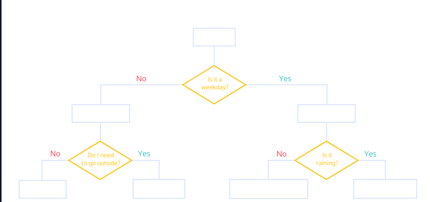

```{r setup, include=FALSE}
knitr::opts_chunk$set(echo = TRUE , cache.lazy = FALSE , warning = FALSE , message = FALSE , fig.width = 10 , fig.height = 5 , options(scipen = 1, digits = 3))
```

# Variables and Data Types

In this section we will see the rules for naming the variables in R , the basic data types available in R and to see two basic R objects; vectors and lists, in detail.

## Naming Variables

The variable name in R has to be alphanumeric characters with an exception of underscore and period, the special characters which can be used in the variable names.

The variable name has to be started always with an alphabet and no other special characters except the underscore and period are allowed in the variable names.

-   Allowed characters are Alphanumeric, '\_' and '.'

-   Always start with alphabets

-   No special characters like !,\@,\#,\$,....

```{r}
# assign the value 7 to variable b2
b2 <- 7
b2
```

This is a valid variable name because it started with an alphabet and it has only alphanumeric characters

```{r}
# assign the value Scientist to variable Monoj_GDPL
Manoj_GDPL = "Scientist"
Manoj_GDPL
```

This is also a valid variable name because it has a special character, but it is underscore which is allowed special

character for the variable names.

```{r , error=TRUE}
# assign the value 7 to variable 2b
2b = 7
```

This gives an error because that variable name has started with the numeric character which is not following the rules for the names of the variables in R

## Data Types

R has the following basic data types shown in the table below with the values that each data type can take.

Logical data types which take either a value of true or false,

Integer data types which is the set of all integers

Numeric data types which is set of all real numbers.

Complex variables which is a set of all the complex numbers.

Character data type where you have all the alphabets and special characters

+-----------------+-------------------------------------------------------------------------------+
| Basic Data Type | Values                                                                        |
+:================+:==============================================================================+
| Logical         | TRUE / FALSE                                                                  |
+-----------------+-------------------------------------------------------------------------------+
| Integer         | Set of Integers (decimals) : 1.2 , 3.4 , 5.8123                               |
+-----------------+-------------------------------------------------------------------------------+
| Numeric         | Set of Real numbers (no decimals) : 1, 4 , 8 , 9                              |
+-----------------+-------------------------------------------------------------------------------+
| Character       | Characters / Strings : "a","b","c","\@","\#","\$", "","\*", "1","2",... etc.. |
+-----------------+-------------------------------------------------------------------------------+

: Basic Data Types

There are several task that can be done using data types

**Find data type of object : Syntax : typeof(object)**

```{r}
# type of a numeric object
typeof(1)
```

```{r}
# type of a character object
typeof("Ravi")
```

**Verify if an object is of a particular type : Syntax : is.data_type(object)**

```{r}
# verify if given object is a character
is.character("Ravi")
```

```{r}
# verify if given object is a number
is.numeric("Ravi")
```

**Coerce or convert data type of object to another : Syntax : as.data_type(object)**

Note : Not all coercing is possible and if attempted will return "NA" as output

```{r}
# convert to numeric
as.numeric("123")
```

```{r error=TRUE}
# convert to numeric
as.numeric("a")
```

# Objects

We have several basic objects of R, in this the most important ones are; vectors, lists and data frames

### Vectors

A vector is an ordered collection of basic data types of given length. All the elements of a vector must be of same data type. The way you creating vector in R is using the concatenation command c()

```{r}
# Exaample of a numeric vector
X <- c(2.3 , 4.6 , 5.5)
print(X)

# Example of a character vector
Y <- c("a" , "b" , "c")
print(Y)
```

### Lists

List is a generic object consisting of ordered collection of objects.List can be a list of vectors, list of matrices, list of characters and list of functions and so on.

We want to build a list of employees with the details for this we want the attributes such as ID, employee name and number of employees.

We are creating each vector for those attributes and combine all these three different data types into a list containing the details of employees which can be done using a list command

```{r}
# List Example : Employee details
# Vectors of individual elemnts of the list
ID = c(1,2,3,4)
emp_name =c("Man","Rag","Sha","Din")
num_emp = c(4)

# create a list containing the vectors
emp.list = list(ID, emp_name,num_emp)

# print the list
print(emp.list)
```

All the components of a list can be named and you can use that names to access the components of the list.

Instead of directly creating a list you can also give the names for this attributes as ID, names of employees and the total staff as shown in the code here.

```{r}
# List Example : Employee details
# Vectors of individual elemnts of the list
ID = c(1,2,3,4)
emp_name =c("Man","Rag","Sha","Din")
num_emp = c(4)

# create a list containing the vectors with names for each vector
emp_list = list("Id" = ID,
                "Names" = emp_name,
                "Total_staff"=num_emp)

# print the list of employees
print(emp_list)
```

We can access individual components of the list by using the "names" of the vectors in the list **list\$vec_name**

```{r}
# print the employee names
print(emp_list$Names)

# print the employee IDs
print(emp_list$Id)
```

We can access sub-elements from a list.To access top level components, we use double slicing operator " [[ ]]" and for lower/inner level components use "[ ]" along with "[[ ]]"

e.g. Get the 1st element of the 1st list of emp_list

```{r}
# print the 1st list of emp_list
print(emp_list[1])

# print the 1st element of the 1st list
print(emp_list[[1]][1])
```

```{r}
# print the 2nd list from emp_list
print(emp_list[2])

# print the 2nd element of the 2nd list
print(emp_list[[2]][2])
```

Concatenation of lists : Two lists can be concatenated using the concatenation function, c(list1, list2)

```{r}
# create a list of employee ages
emp_ages = list("ages" = c(23,45,30,32))
```

```{r}
# combine emp_list with emp_ages
emp_list = c(emp_list , emp_ages)
```

```{r}
# print the new list
print(emp_list)
```

### DataFrames

Data frame are generic data objects of R which you are used to store the tabular data. Data frames are the most popular data objects in R programming because we are comfortable in seeing the data in the tabular form.

Data frames can also be thought as matrices where each column of a matrix can be of different data type.

Let us see how to create a data frame in R.

#### Create Data Frames from Vectors

The way you create the data frame is use the data.frame() command and then pass each of the vector elements you have created as arguments to the function data.frame()

```{r}
# Create the individual Vectors
vec1 = c(1,2,3)
vec2 = c("R","Scilab","Java")
vec3 = c("For prototyping","For prototyping","For Scaleup")
```

```{r}
# Create a dataFrame df
df = data.frame(vec1 , vec2 , vec3)

# View the data frame
df
```

#### Create a Data Frame from a File

A Dataframe can be created by reading data from a file e.g. ".csv file" using the read.table() method

We need to specify the "separator" and "header = TRUE"

```{r}
new_df = read.table("artists.csv" , sep = "," , header = TRUE)
```

A Dataframe can also be created using the "dplyr's" `read_csv()` function

```{r message=FALSE}
# load the tidyverse library
library(tidyverse)
```

```{r , message=FALSE}
# create a dataframe
artists_df = read_csv("artists.csv")
```

#### Inspecting a Data-Frame

The `head()` function returns the first 6 rows of a data frame. If you want to see more rows, you can pass an additional argument `n` to `head()`. For example, `head(df,8)` will show the first `8` rows.

The glimpse() function returns the structure of the dataframe along with sample observations

The function `summary()` will return summary statistics such as mean, median, minimum and maximum for each numeric column while providing class and length information for non-numeric columns.

```{r}
# inspect top 6 rows
head(artists_df)
```

```{r}
# inspect the structure of the dataframe
glimpse(artists_df)
```

```{r}
# summary statistics
summary(artists_df)
```

# String Handling

We will learn to work with strings. For this we will analyse one of my favorite books: George Orwell's 1984.

**Objectives**: Learn string handling, e.g. functions \_grep()\_, \_gsub()\_, \_nchar()\_, \_strsplit()\_, and many more

## Packages

Let us load the packages required for analyzing strings

```{r , message=FALSE , warning=FALSE}
library(tidyverse)
```

## Import

Let us import the book into an object. This book is available for download. The link is stored in variable "url" and the text is downloaded with \_readLines()\_ and save in "text_1984".

```{r import book , cache=TRUE}
url <- "http://gutenberg.net.au/ebooks01/0100021.txt"
text_1984 <- readLines(url)
```

Filtering

The book has some overhead: introductory text at the beginning and some appendix at the end. We want to analyse the pure book, so we filter the text to its core

We will extract the text from line\#47 till the end of the text and store this in a new object text_1984_filt. Note the index of the last element of the text = length of the text

```{r}
# filter the desired text
text_1984_filt <- text_1984[46: length(text_1984)]
text_1984_filt <- text_1984_filt[1:9859]
```

```{r}
# look at the top 6 rows
head(text_1984_filt)

# look at the bottom 6 rows
tail(text_1984_filt)
```

What is the structure of the object?

```{r}
str(text_1984_filt)
```

It is a character vector with 9865 elements. There is just one problem. Some elements contain several words, some don't contain a single word. Our aim is to have a vector with a single word as each element.

We will now convert this into one single string i.e. concatenate all the elements together

## Concatenate with paste()

First, we collapse this vector to one single string. This can be done with \_paste()\_ function. The separators will be blank signs between the words. In a second step we modify all letters to lower letters with \_str_to_lower()\_

```{r}
# collapse to a single string
text_1984_one_single_string <- paste(text_1984_filt, collapse = " ")
text_1984_one_single_string <- str_to_lower(text_1984_one_single_string)
```

You can see in the "environment" that the size is now reduced to 560KB from 1.3MB...

## Separate each word str_split()

We will now separate each sentence into a word considering the fact that words are separated by "blank spaces" and get the 1st list element

```{r}
# separate each word
text_1984_separate_words <- str_split(string = text_1984_one_single_string, pattern = " ")[[1]]
```

## Finding Patterns : grep()

we are interested in analyzing words so we will exclude all numbers. We will find out with \_grep()\_ or \_str_subset()\_. These commands search for matches within the text.

But how can we define all numbers? The easy way is to run \_grep()\_ with parameter "0", "1", "2", ... But this takes quite some effort and contradicts DRY (don't repeat yourself principle).

There is a better way. You can use "[0-9]" for all numbers from 0 to 9. This is a regular expression.

Let us look at what are the numbers in the text. Here we use the str_subset() function with pattern = [0-9].Here [0-9] is the regular expression "regex" pattern for numbers

```{r}
# head(grep("[0-9]", text_1984_separate_words, value = T))
head(str_subset(string = text_1984_separate_words, pattern = "[0-9]"))
```

We can use this regular expression to remove numbers and hyphens.

We will find the patterns [0-9] and "-" and replace these with "blank spaces"

```{r}
# delete numbers
text_1984_separate_words <- str_replace_all(pattern = "[0-9]", 
                                            replacement = "", 
                                            string = text_1984_separate_words)

# delete hyphens
text_1984_separate_words <- str_replace_all(pattern = "-", 
                                            replacement = " ",
                                            string = text_1984_separate_words)
head(text_1984_separate_words)
```

## Delete Empty Words : str_length()

There are still empty elements, which we will delete in the next step. Empty element have zero characters, which we can find out with \_str_length()\_. so we filter for \_str_length()\_ \> 0.

```{r}
# delete empty words
text_1984_separate_words <- text_1984_separate_words[str_length(text_1984_separate_words) > 0]
```

## Character Occurrences

The main characters are "Winston", "Julia", "O'Brien" and of in a way "big brother". with \_table()\_ the number of occurrences are shown. We concentrate on the main characters and filter for them with"[ ]".

```{r}
table(text_1984_separate_words)[c("winston", "julia", "o\'brien", "brother")]
```

Not surprisingly "Winston" as the main character has the most appearances.This is not sorted. We can order this table with \_sort()\_. Default is ascending order, but with parameter "decreasing = T" it is changed to decreasing.

```{r}
sort(table(text_1984_separate_words)[c("winston", "julia", "o\'brien", "brother")], decreasing = T)
```

## Shortest and Longest Word : which.max/min combined with str_length

I am curious about finding out, what the shortest word is. We already know the length of a word can be found with \_str_length()\_. Now, we need to find the position of maximum and use \_which.max()\_.

```{r}
pos_min <- which.min(str_length(text_1984_separate_words))
text_1984_separate_words[pos_min]
```

Surprise, surprise. The shortest word is "a". The opposite is \_which.max()\_. Find out for yourself what the longest word is.

```{r}
pos_max <- which.max(str_length(text_1984_separate_words))
text_1984_separate_words[pos_max]
```

## Word Lengths : Distribution of Words

What are the distribution of word lengths. Let's see with hist()\_ and plot a histogram.

```{r}
hist(str_length(text_1984_separate_words), breaks = seq(1, 30, 1))
```

# Time and Date Handling

If you deal with datasets that contain date and time, these are usually imported as factors, which is not helpful for further processing. You need to apply some special measures to transform it to an R date object or to extract information like days, or hours. In this tutorial you will learn how this works.

**Objectives**: Learning to create R-time objects (POSIX) from characters or factors, extract components from POSIX timestamp

**Requirements**: R Basics; ggplot\_ and dplyr might be helpful, but are not required

## Data Import and Understanding

We use "CalIt2 Building People Counts Data Set" from "UCI Machine Learning Repository". It includes observations on people flowing in or out of a building, measured over 15 weeks, half hour count aggregates.

For analysis we need dplyr\_ package. ggplot2\_ is used for visualization. Let us load these packages first.

```{r}
library(tidyverse)
library(lubridate)
```

"url" gets the http address of data. Data is downloaded with \_read.csv(). Column names are not included in the data, so we add this manually. Information on inflow or outflow is coded with numerics (7 for outflow, 9 for inflow).

We create an additional column flow_stream with corresponding information as string ("out" or "in"). Original "flow" column is deleted afterwards. Finally, we take a look at the data with tbl_df() from dplyr package.

```{r import , cache=TRUE}
# url for the data
url <- "http://archive.ics.uci.edu/ml/machine-learning-databases/event-detection/CalIt2.data"

# read the data into a dataframe
building <- read.csv(url, header = F)

# add column names
colnames(building) <- c("flow", "date", "time", "count")

# initialize the flow_stream column with null values
building$flow_stream <- NA

# if flow = 7 then out and if flow = 9 then in
building$flow_stream[building$flow == 7] <- "out"
building$flow_stream[building$flow == 9] <- "in"

# convert flow to factor
building$flow <- as.factor(building$flow_stream)

# examine the data
head(tbl_df(building))

```

There is a column "date" and a column "time". Both have the type factor. You can't use factor to plot a date or time information. You first need to convert it to a "POSIX" object.

## Time and Date Conversion

Information on date and time are stored in two separate columns, but it makes more sense to have it as a single timestamp, because it describes one unique timestamp. Thus, both columns are concatenated with *paste().*We will create a new column timestamp_chr that stores the concatenated date and time.

```{r}
building$timestamp_chr <- paste(building$date, building$time)
str(building$timestamp_chr)
```

The result is of type character, not helpful either, we will change this in the next step. But now we know which component of timestamp is stored at which position and what the separator is. R cannot know by itself which component is a year, and which one a month. This knowledge we need to explain to R in the next step.

We found out that our timestamp has the following components: first month, then day, year, hour, minute, and second

We will use the mdy_hms() method from lubridate to convert the charater date time column to a date time variable

We will add a new column time_stamp

```{r}
# convert the character date to desired date time format
building$time_stamp = mdy_hms(building$timestamp_chr)
str(building)
```

Let's take a look at in and outflow. To see some details, only the first 500 datasets are shown

```{r}
g <- ggplot(building[1:500, ], aes(x = time_stamp, y = count, color = flow))
g <- g + geom_line()
g
```

## Extract Timestamp Information

We want to know how many people went in and out of the building in each hour of the day. For this, we need to extract "hour" from timestamp.We apply the hour() method from lubridate to the time_stamp column to extract the hour

```{r}
# extract the hour
building$hour <- hour(building$time_stamp)
str(building)
```

We are done with time and date handling at this point. If you are interested in diurnal flow, please read on.

What is diurnal flow pattern? We can analyse it with \_ddply()\_ from \_plyr\_ package and visualise it with \_ggplot\_.

If you are not familiar with ddply(), here is a short explanation. Our data "building" is used as input. We create a summary for "hour" and "flow". For each combination of "hour" and "flow" data is split and a summary of following functions is created for the subgroup. We create a summary for "count", which is the sum of all counts in this group. The result is visualized with \_ggplot()\_.

```{r}
hour_flow <- building %>% 
	group_by(hour, flow) %>% 
  summarise(count = sum(count)) %>%
    ungroup()

g <- ggplot(hour_flow, aes(x = hour, y = count, color = flow))
g <- g + geom_line()
g <- g + scale_x_continuous(breaks = seq(0, 23, 1))
g <- g+ theme_bw()
g
```

Most people start working between 9AM and 10AM, and head home between 5 and 7PM. It is likely there is a canteen in the building since there is a spike of inflow around 1PM.

# Control Flow (Conditional Execution)

In this section, we will be covering what control flow is conceptually, and how we can establish control flow in R. We will introduce if/else blocks through various examples and challenges.

First, take a look at the diagram below. This is a series of decisions we might be making each morning, where a YES will send us one way, and a NO will send us the other. Different choices open up, while other outcomes become impossible. {width="618"}

We want our programs, in R to have a similar way of making decisions based on whether certain conditions are true at different steps. A program will run and start moving through its checklists and ask "is this condition met?" then execute a code block if the answer is yes, or skip it if the answer is no. This is the *Control Flow* of a program.

R is a script language, meaning every code file executes from the top down, until there is nothing left to run. It is the programmer's job to include gateways throughout, known as conditional statements, to tell the computer whether or not it should execute certain blocks of code.

We will cover how to build conditional statements that check logical (`TRUE` or `FALSE`) values, just like the YES's or NO's from above, and manage the control flow in our code.

## If Statements

The most basic kind of conditional statement is an `if` statement. If a certain condition is true, execute this code. The syntax looks like so:

    if (condition_to_check) {
    # code to execute
    }

A short example:

```{r}
a <- 10
if (a < 12){
    print("The variable a is less than 12")
}
```

`if` is an R keyword, followed by a condition inside the parentheses (). The code for the condition should evaluate to a `TRUE` or `FALSE`.

As a refresher, in order for a code expression to evaluate to a `TRUE` or `FALSE` value, we can use comparison operators like `<`, `>`, `>=`, `<=`, `==`, and `!=`. We can combine `TRUE` and `FALSE` values with logical operators like `&` (AND), `|` (OR), and `!` (NOT).

Let us look at another example

```{r}
# load dataframe
df <- read.csv('artists.csv')
```

```{r}
# create a variable with the condition
use_short_data <- TRUE
```

```{r}
if (use_short_data) {
  # get only the first 3 rows of dataframe
  df <- head(df, 3)
}

# the number of rows in the dataframe
nrow(df)
```

The conditional allows us to switch whether we want to cut a data frame short or not. In the `if` statement, we check the value of the variable `use_short_data`. If it is `TRUE`, we will only use the first 3 rows.

In the last line of code, we print how many rows are in the dataframe currently.

Let us change the use_short_data to FALSE and re-run the statement

```{r}
# load dataframe
df <- read.csv('artists.csv')

# create a variable with the condition
use_short_data <- FALSE

if (use_short_data) {
  # get only the first 5 rows of dataframe
  df <- head(df , 3)
}

# the number of rows in the dataframe
nrow(df)
```

We can see that the condition in if statement evaluated to FALSE and we displayed all the rows in the dataframe

## **If, Else**

If we want a program to execute some code if a condition IS true, or some other code in case the condition is NOT true, you could add an `else` block to the `if`. Below is the syntax. This is the conventional way of connecting them, with the `else` block directly following the closing bracket of the `if` block. Only one of the code options will execute.

    if (condition_to_check) {
        # execute some code
    } else {
        # execute some other code
    }

```{r}
# initialize number of students
number_of_students <- 88
# initialize funding
funding <- 30000
# calculate amount of funds per student
amount_per_student <- funding / number_of_students

# condition 1 : amount per student > 500
if (amount_per_student >= 500) {
   print("We have enough funding for each student!")
    # condition 2 : amount per student between 400 and 500
} else if (amount_per_student < 500 & amount_per_student >= 400) {
   print("We cannot afford stationery and planners for students.")
    # condition 3 : amount per student between 300 and 400
} else if (amount_per_student < 400 & amount_per_student >= 300) {
   print("We cannot afford stationery, planners, and have to cut down on printing.")
    # if all conditions not met
} else {
   print("We're lacking funds this year.")
}
```

`mount_per_student` ends up being approximately 341, which will satisfy the `else if` condition that prints this statement. Once this condition is satisfied, the code will skip checking the remaining conditions.

# Loops

This section we will introduce loops in R and why they are useful as a basic programming structure. We will learn to use loops to iterate through data structures and to execute code a set number of times or based on a condition.

A **loop** is a control structure in programming where the instructions are written once, but a computer can execute them multiple times. Each execution of those instructions is called an **iteration**.

Loops are commonly used in programming because, compared to repeated lines of code, they save time, reduce error, and are easy to read.

A loop allows a set of steps to repeat, either with a predefined number of repetitions or with a condition that keeps the loop going.

There are two types of loops in R: **for loops** and **while loops**. **For loops** repeat a piece of code for a known number of iterations, and a **while loop** repeats while a condition holds true.

## For loops

Using **for loops**, you can tell a piece of code to run a defined X number of times or to iterate through the length of a data structure. The for loop requires a variable or counter that keeps track of where the current iteration is.

When we know an exact number of times we want the code to repeat, we can set up our for loop to count from 1 to X, and the code will stop executing after the X^th^ iteration.

Below, is the basic outline of a for loop that has a counter.

We need the `for` keyword, a `loop_variable` to serve as the counter, the `in` keyword, and a range of `1` to `number_of_iterations`. We refer to the code inside of the curly `{` `}` brackets as the body of the loop.

    for (loop_variable in 1:number_of_iterations) {
        # execute this code
    }

`loop_variable` can be used inside the loop if the number of the current iteration affects the code inside, but the variable only has meaning inside the loop. If you try to use that variable outside the loop, you'll get an error.

Let's say we want to print `"Hello"` 10 times without having 10 lines of `print("Hello")`.

```{r}
for (i in 1:10) {
    print("HELLO")
}
```

Another use case of for loops is iterating through a data structure's elements. The syntax for this also requires a loop variable, the keyword `in`, and the data structure's name.

    for (loop_variable in data_structure) {
    # execute this code
    }

The code below will print out the words in the vector `my_vector`, in order, one by one.

The loop variable `word` inside the `for` statement here is the placeholder for whichever is the current element in `my_vector`.

The print statement will therefore print that element.

On the first iteration, `word` equals `"this"`. On the second, `word` equals `"vector"`. And so on.

In this instance, the loop variable is used in the body of the loop.

```{r}
# declare a vector of words
my_vector <- c("this", "vector", "is", "being", "read", "by", "a", "for", "loop")

# print the elements of the vector iteratively
for(word in my_vector){
  print(word)
}
```

## While Loops

**While loops** repeat a code block *while* a certain condition is true. While loops take a little more reasoning because we want to make sure the loop ends when we intend for it to end. We also need to make sure the condition starts as true so the loop runs
in the first place. First, the syntax looks like this:

    while (condition_to_check) {
       # execute this code
    }

Usually, the code inside the while loop will change the value of a variable in the condition. This allows the condition to eventually become `FALSE`.

Let's say we want a piece of code to simulate flipping a coin until it lands on heads twice.

What would be our `while` condition? We want it to be a condition that will become `FALSE` when we want the loop to end. The condition could be that the flipping code repeats while the number of heads is still less than two. That means we want a variable, which we can call `num_heads` and define as `0` to begin with, to keep track of how many times we get heads.

Consider what would happen if our while condition was `1 < 2`, a statement that is always true. Our while loop would never end! But if our condition was something like `num_heads < 2`, and in the loop we incremented `num_heads` by `1` if the coin landed on heads, then the `while` loop would definitely end if `num_heads` ever became `2` or more.

```{r}
# initiatilze the counter for number of heads
number_of_heads <- 0

# set the goal of number of heads
heads_goal <- 2
coin <- c("heads", "tails")
while (number_of_heads < heads_goal) {
  # flip the coin (random)
  result <- sample(coin, 1)
  print(result)
  if (result == "heads") {
    number_of_heads <- number_of_heads + 1
  }
}
```
